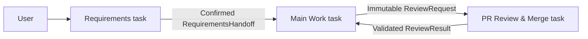

# Requirements Session Workflow

## Lifecycle Status

- Feature: Add a dedicated requirements collection and confirmation task to
  Codex Feature Lifecycle.
- Branch: `agent/add-requirements-doc-skill`
- Pull request: `#4`
- Current phase: F0 — Intake and repository hygiene
- Repository: `zhanghao1903/my-skills`
- Affected plugin: `plugins/codex-feature-lifecycle`

## F0 — Intake and Repository Hygiene

### User scenario

The workflow currently asks users to send a feature directly to Main Work.
Requirements elicitation and confirmation therefore compete with design,
implementation, and PR preparation inside one long-lived task. The user wants
Init to allocate a separate task that owns natural-language requirements
collection and explicit confirmation.

### Current behavior

- Init creates or binds exactly two tasks: Main Work and PR Review & Merge.
- Main Work owns intake and requirements as well as implementation.
- There is no structured requirements-to-main handoff or durable route for a
  requirements task.

### Desired behavior

- Init creates or binds three distinct repository-scoped tasks:
  Requirements, Main Work, and PR Review & Merge.
- Users begin feature work in Requirements.
- Requirements converts natural language into a documented, explicitly
  confirmed requirement snapshot.
- Requirements proactively sends a validated handoff to Main Work.
- Main Work refuses implementation without a valid confirmed-requirements
  handoff, then continues the existing review dispatch workflow.

### Repository hygiene

- The feature branch is dedicated to the requirements-writing skill and its
  workflow integration.
- The worktree was clean before this document was created.
- The previously merged two-task plugin is present on `main`.
- No unrelated local or generated files are in scope.

### Initial impact

- Public plugin behavior: Init topology changes from two tasks to three.
- Local config: a Requirements task route must be stored.
- Workflow protocol: a versioned requirements handoff is required.
- Existing installations: re-running Init must add the missing Requirements
  route without discarding review dispatch history.
- GitHub merge policy and reviewer boundaries remain unchanged.

### Phase plan

- F1: confirm requirements, non-goals, compatibility, and recovery.
- F2: specify task topology, handoff contract, state transitions, and upgrade
  behavior.
- F3: identify exact files, tests, docs, and rollback.
- F4: implement the role skill, deterministic handoff, Init upgrade, and tests.
- F5: validate manifests, skills, contracts, state transitions, and role
  behavior.
- F6: update plugin metadata, release record, and PR description.

## F1 — Confirmed Requirements

- Status: Confirmed
- Confirmation source: User requested that the existing plugin include the
  requirements-writing skill and that Init use one task for requirements
  collection and confirmation.
- Confirmation date: 2026-07-25

### Goals

- Separate requirements conversation from implementation context.
- Give the user one durable task dedicated to elicitation and confirmation.
- Automatically advance confirmed requirements to Main Work without requiring
  the user to copy instructions between tasks.
- Preserve independent PR review and the existing exact-head merge gate.
- Make the requirements-to-main boundary deterministic and auditable.

### Non-goals

- No cross-application or non-Codex routing.
- No automatic product decision or implicit confirmation.
- No implementation, PR review, merge, or release from the Requirements task.
- No storage of raw user prompts, transcripts, source code, or credentials in
  plugin local state.
- No change to review decision or merge authorization semantics.

### Functional requirements

| ID | Requirement |
| --- | --- |
| REQ-001 | Init must create or bind exactly three distinct project-scoped tasks: Requirements, Main Work, and PR Review & Merge. |
| REQ-002 | The Requirements task must turn natural-language input into a repository requirements document with stable requirement, acceptance-criterion, assumption, and decision identifiers. |
| REQ-003 | The Requirements task must keep the document in Draft or Pending Confirmation until the user explicitly confirms the current snapshot. |
| REQ-004 | After explicit confirmation, the Requirements task must commit and push the confirmed document, prepare a versioned structured handoff, and proactively send it to Main Work. |
| REQ-005 | Main Work must validate the handoff against repository-local workflow state, configured routes, the exact requirements commit, document path, and document digest before starting design or implementation. |
| REQ-006 | A direct unconfirmed feature request sent to Main Work must not bypass the Requirements task; Main Work must route the user back to the configured Requirements task. |
| REQ-007 | Init and handoff delivery must remain idempotent, with explicit retryable delivery-failure state and no partial configuration written before all three tasks are ready. |
| REQ-008 | Re-running Init for an existing healthy two-task configuration must add and prove the Requirements route while preserving workflow identity, merge policy, and review dispatch history. |
| REQ-009 | Local state may store routing identifiers, hashes, paths, commits, status, and timestamps, but not raw requests, transcripts, full document content, code, diffs, findings, or credentials. |
| REQ-010 | The Main Work to PR Review & Merge handoff and all exact-head/check/authorization merge gates must continue to behave as before. |

### Acceptance criteria

| ID | Requirement IDs | Criterion |
| --- | --- | --- |
| AC-001 | REQ-001, REQ-007 | Given no workflow config, when Init succeeds, then three distinct task IDs are persisted only after all three return exact readiness markers. |
| AC-002 | REQ-002, REQ-003 | Given a natural-language feature request, when material ambiguity remains or the user has not explicitly confirmed, then the Requirements task produces or updates a requirements document and does not dispatch Main Work. |
| AC-003 | REQ-004, REQ-009 | Given an explicitly confirmed document committed at an exact SHA, when handoff preparation succeeds, then the emitted object contains only workflow/repository identity, safe feature metadata, route IDs, document path/hash, commit SHA, confirmation metadata, and timestamps. |
| AC-004 | REQ-005 | Given a forged route, wrong workflow, unsafe path, changed document, or mismatched commit/hash, when Main Work accepts the handoff, then validation fails without starting implementation. |
| AC-005 | REQ-004, REQ-007 | Given uncertain handoff delivery, when Requirements retries, then it reuses the same handoff ID and content rather than starting a duplicate feature. |
| AC-006 | REQ-006 | Given a feature prompt without a valid handoff in Main Work, then Main Work identifies the configured Requirements task and refuses to enter design or implementation. |
| AC-007 | REQ-008 | Given a valid two-task config and existing review state, when Init upgrades it with a proven Requirements task, then workflow ID, policy, and review dispatch records remain unchanged. |
| AC-008 | REQ-010 | Existing review request/result positive and negative fixtures and state-machine tests continue to pass. |

### Recovery expectations

- If any newly created task fails readiness, Init writes no new configuration
  and may archive only tasks created in that failed attempt.
- If requirements delivery fails, retain a retryable prepared handoff and send
  the exact same object again.
- If Main Work observes a new requirements commit after accepting an earlier
  one, treat it as a scope revision and require a new handoff.
- If a legacy config cannot be safely upgraded, preserve it and report the
  exact route or state conflict instead of overwriting it.

### Confirmed assumptions

- "Use one task" means add a third durable role task, not temporarily reuse
  Main Work or PR Review & Merge.
- Explicit confirmation occurs in the Requirements task that owns the current
  document snapshot.
- The confirmed requirements document is committed and pushed before handoff
  so Main Work can verify a durable repository artifact.
- Existing schema version 1 configs will be upgraded additively by Init rather
  than invalidated solely because the Requirements route is absent.

## F2 — Consumer Contract and Design

### Task topology



The Requirements task is the feature entry point. Main Work remains the only
source-code author, and PR Review & Merge remains the only independent review
and optionally authorized merge role.

### Role ownership

| Role | Owns | Must not do |
| --- | --- | --- |
| Requirements | Natural-language intake, requirements document, user confirmation, requirements commit/push, handoff delivery | Technical design, source implementation, PR review, merge, release |
| Main Work | Handoff validation, design, implementation, tests/docs, PR, finding remediation, traceability | Infer confirmation, approve or merge own work |
| PR Review & Merge | Immutable-snapshot review, findings, exact-head merge gate, result delivery | Edit or repair feature code |

### Local configuration

`config.threads` becomes:

```json
{
  "requirements": "<requirements-task-id>",
  "main": "<main-task-id>",
  "reviewer": "<review-task-id>"
}
```

The Requirements route is optional only while reading a legacy schema-version
1 config. Every new or successfully upgraded config contains all three IDs,
which must be pairwise distinct.

When `init` reads a valid two-task config and the requested project, host, Main
route, reviewer route, and merge policy are unchanged, adding
`threads.requirements` is an additive upgrade:

- preserve `workflowId`, `createdAt`, policy, and state;
- write the three-route config atomically;
- return `upgraded: true`;
- do not require broad `--replace`.

Any other difference retains the existing explicit replacement gate.

### RequirementsHandoff contract

Add `schemas/requirements-handoff.schema.json` with this public shape:

```json
{
  "schemaVersion": 1,
  "messageType": "RequirementsHandoff",
  "workflowId": "<uuid>",
  "handoffId": "<64-lowercase-hex>",
  "repository": {
    "key": "<24-lowercase-hex>",
    "origin": "https://github.com/owner/repository"
  },
  "feature": {
    "slug": "feature-slug",
    "title": "Human title",
    "branch": "feature/branch",
    "requirementsPath": "docs/feature/feature-slug/requirements.md",
    "requirementsCommitSha": "<40-lowercase-hex>",
    "requirementsSha256": "<64-lowercase-hex>"
  },
  "confirmation": {
    "status": "CONFIRMED",
    "confirmedBy": "User-visible identity",
    "confirmedAt": "<RFC3339 UTC>",
    "evidence": "Safe summary of explicit confirmation"
  },
  "routes": {
    "sourceThreadId": "<requirements-task-id>",
    "destinationThreadId": "<main-task-id>",
    "hostId": "<optional-host-id>"
  },
  "createdAt": "<RFC3339 UTC>"
}
```

The handoff ID is a deterministic digest of workflow/repository identity,
feature slug and branch, requirements path/commit/content digest, and the
Requirements-to-Main route. Re-preparing the same confirmed snapshot produces
the same ID and message.

### Requirements document contract

The committed requirements Markdown may use any language but must retain this
canonical metadata block near the top:

```text
- Status: Confirmed
- Confirmed by: <non-placeholder identity>
- Confirmed at: <RFC3339 UTC>
```

`prepare-requirements` reads the document from the exact commit, rejects unsafe
or escaping paths, computes its SHA-256, and rejects Draft, Pending, placeholder,
uncommitted, or mismatched content. The Requirements role separately proves
through GitHub that the named branch is pushed at the exact commit.

### Handoff state

`state.requirementsHandoffs` stores only deterministic metadata:

```text
prepared -> dispatched -> accepted
    |
    +----> delivery_failed -> prepared
```

The record contains feature slug, branch, document path, commit, content hash,
route IDs, handoff digest, status, and timestamps. It does not store the title,
confirmation prose, document contents, user request, or transcript.

Main may accept a handoff before Requirements marks delivery; a later
`mark-requirements-dispatched` call must not regress `accepted`.

### Commands

- `prepare-requirements`: validate the committed confirmed document, prepare
  the idempotent handoff, and persist `prepared`.
- `mark-requirements-dispatched`: record host-confirmed delivery without
  regressing a fast `accepted` transition.
- `mark-requirements-delivery-failed`: retain a retryable exact handoff.
- `accept-requirements`: validate schema, route, repository, state digest,
  commit, path, and content hash before moving to `accepted`.

### Main Work gate

Main Work accepts only fenced `RequirementsHandoff` JSON. It fetches the named
branch, verifies GitHub points at the exact requirements commit, writes the
payload to a task-specific temporary file, and runs `accept-requirements`.
Only an accepted result authorizes F2 design and later phases.

If the user sends an ordinary feature request directly to Main Work, Main
reports the configured Requirements task ID and asks the user to continue
there. It must not synthesize its own handoff.

### Safety and compatibility

- The requirements role may write only requirements artifacts and their
  phase-scoped commit; it never writes implementation files.
- No task ID is selected by title when multiple candidates exist.
- Local state remains private and contains no raw conversation content.
- Existing review dispatch state and schemas remain unchanged.
- Plugin version advances to `0.2.0`; reinstall and re-run Init are required to
  add the third task to existing installations.
- Rollback to `0.1.0` leaves the additive Requirements route and handoff records
  unread by the old plugin; existing Main/Reviewer routes and review records
  remain structurally valid.

## F3 — Implementation Plan

### Implementation slices

| Slice | Files | Behavior | Verification |
| --- | --- | --- | --- |
| Requirements role | `skills/codex-requirements-intake/**` | Add the durable intake/confirmation role, canonical template, readiness marker, commit/push rule, and automatic handoff delivery. | Skill validation and role contract tests. |
| Init topology | `skills/codex-workflow-init/**` | Preflight, create/bind, ready-check, persist, inspect, and recover three tasks; upgrade a healthy two-task config. | Skill contract tests and init state tests. |
| Main gate | `skills/codex-feature-main/**` | Require an accepted RequirementsHandoff before F2; route direct requests to Requirements. | Role contract tests and forward test. |
| Handoff protocol | `schemas/requirements-handoff.schema.json`, `scripts/workflowctl.py` | Validate, prepare, retry, dispatch, and accept exact confirmed requirements snapshots. | Positive/negative fixtures and state-machine tests. |
| Contract tooling | `scripts/validate_contracts.py`, `tests/fixtures/**`, `tests/test_contracts.py` | Cross-check JSON Schema and runtime validators for valid and invalid handoffs. | Contract verifier and unit suite. |
| Product metadata | `.codex-plugin/plugin.json`, `CHANGELOG.md`, root `README.md`, setup references | Describe three-role behavior, version `0.2.0`, install/update/init flow, and user entry point. | Plugin validator, JSON parsing, diff check. |

### workflowctl implementation details

- Keep `SCHEMA_VERSION = 1` because the new config field and state map are
  additive and legacy config/state remain readable.
- Accept `threads.requirements` as optional in validation but require it for
  requirements commands and every new Init result.
- Add `requirementsHandoffs` as an optional legacy state field and include it
  in all newly initialized state.
- Detect the one allowed implicit config upgrade:
  - existing config has no Requirements route;
  - proposed config adds it;
  - all other config fields match after timestamp normalization.
- Preserve existing state during that upgrade.
- Add safe repository-relative path validation and exact committed-content
  loading through `git show <commit>:<path>`.
- Parse the canonical confirmation metadata from committed Markdown.
- Store only the handoff digest and safe routing/snapshot metadata in state.

### Test matrix

- New Init writes three distinct routes.
- Repeated three-task Init reuses config and identity.
- Two-task legacy config upgrades without `--replace` and preserves review
  dispatches.
- Duplicate or overlapping task IDs fail.
- Valid confirmed document prepares and accepts a handoff.
- Draft/Pending document fails.
- Missing commit, unsafe path, changed digest, wrong workflow/repository/route,
  tampered handoff, and mismatched state fail.
- Delivery failure retries the same handoff ID.
- Fast Main acceptance cannot regress to dispatched.
- Existing ReviewRequest/ReviewResult tests continue to pass.
- All four plugin role skills validate and only Requirements/Main permit
  implicit invocation.

### Planned commands

```text
python3 <plugin-creator>/scripts/validate_plugin.py plugins/codex-feature-lifecycle
python3 <skill-creator>/scripts/quick_validate.py plugins/codex-feature-lifecycle/skills/<skill>
python3 plugins/codex-feature-lifecycle/scripts/validate_contracts.py
python3 -m unittest discover -s plugins/codex-feature-lifecycle/tests -p 'test_*.py' -v
python3 -m json.tool <every changed JSON file>
git diff --check
```

### Rollout and rollback

- Roll out by installing/upgrading plugin `0.2.0`, starting a new Codex task,
  and explicitly running `$codex-workflow-init`.
- Existing workflows remain operational for review while not upgraded, but
  Main Work will require the new Requirements route before starting a new
  feature.
- Roll back by reinstalling `0.1.0`. Do not delete the Requirements task or
  local state automatically; the old Main/Reviewer routes remain available.
- No release publication, marketplace promotion, or automatic merge is part of
  this implementation pass.

## F4 — Implementation Notes

### Completed implementation

- Added `codex-requirements-intake` as an implicitly invocable durable role
  skill with:
  - natural-language requirements normalization;
  - canonical confirmation metadata;
  - requirements-only commit and push boundaries;
  - automatic structured handoff to Main Work;
  - idempotent delivery and revision rules.
- Added `RequirementsHandoff` JSON Schema, positive/negative fixtures, runtime
  validation, and schema/runtime parity checks.
- Extended `workflowctl.py` with:
  - additive legacy config and state validation;
  - exactly three distinct task routes for new Init;
  - safe legacy two-task upgrade preserving workflow identity and review state;
  - committed requirements path/content/confirmation validation;
  - deterministic handoff ID and digest;
  - prepare, delivery-success, delivery-failure, and accept commands;
  - fast-acceptance-safe state transitions.
- Updated Init to create/bind/wait for Requirements, Main Work, and PR Review &
  Merge and to direct new features to Requirements.
- Updated Main Work to refuse direct unconfirmed feature requests, validate
  RequirementsHandoff, and start lifecycle execution at F2.
- Preserved existing ReviewRequest, ReviewResult, reviewer role, and merge
  authorization behavior.

### Implementation checks

- Plugin unit/contract/state suite: 36 tests passed.
- Existing review flow regression tests: passed.
- Requirements handoff positive and negative runtime validation: passed.
- JSON parsing and `git diff --check`: passed at the implementation checkpoint.

### Deferred to F5/F6

- Run plugin and all four skill validators with their validation dependencies.
- Run JSON Schema validation through `jsonschema`, not only runtime fallback.
- Forward-test the Requirements-to-Main role boundary with minimal context.
- Update plugin version, public descriptions, changelog, root index, and PR
  release record.

## F5 — Verification

### Automated validation

- Plugin validator: passed.
- Skill validator:
  - `codex-workflow-init`: passed.
  - `codex-requirements-intake`: passed.
  - `codex-feature-main`: passed.
  - `codex-pr-review-merge`: passed.
- Contract validator using JSON Schema plus runtime validation: 8 fixtures
  passed with 0 failures.
- Plugin unit, contract, skill-contract, and workflow-state suite: 36 tests
  passed.
- Existing ReviewRequest/ReviewResult dispatch and merge-policy regression
  tests remained green.
- Repository diff check and generated-artifact inspection: passed.

### Independent forward test

An independent task received a direct feature request while acting as an
initialized Main Work role without a fenced `RequirementsHandoff`.

Expected and observed behavior:

- remained at the F0–F1 boundary;
- directed the user to the configured Requirements task;
- required a confirmed fenced handoff before continuing;
- did not synthesize a handoff, design, plan, edit code, or mutate workflow
  state.

Result: **PASS** — the requirements-confirmation gate held under minimal
context.

### Verification conclusion

The three-task workflow, additive legacy upgrade, confirmation evidence,
handoff idempotency, and existing review workflow are ready for the `0.2.0`
metadata and release-record update.

## F6 — Documentation and Release Record

### Public metadata

- Advanced `codex-feature-lifecycle` from `0.1.0` to `0.2.0`.
- Updated the plugin description and default prompts to make Requirements the
  entry point for new features.
- Updated the repository plugin index and install guidance to describe the
  three durable tasks.
- Added a plugin changelog with upgrade and compatibility notes.

### Release impact

- New installs create Requirements, Main Work, and PR Review & Merge tasks.
- Existing healthy `0.1.x` two-task configurations can be upgraded additively
  by rerunning Init with a new Requirements task.
- Existing review dispatch records and merge policy are preserved.
- No external release tag, marketplace promotion, merge, or deployment was
  performed in this change.

### Pull request record

- Target repository: `zhanghao1903/my-skills`.
- Target pull request: `#4`.
- The pull request description records the new standalone requirements skill,
  plugin `0.2.0` topology, compatibility behavior, and verification evidence.

## F7 — Public Directory Preparation

### Distribution paths

- GitHub marketplace source: `zhanghao1903/my-skills`, marketplace name
  `my-skills`.
- Public-directory submission type: **Skills only**.
- Release version: `0.2.0`.
- Public submission must use the final merged `main` tree, not a PR branch or
  local working copy.
- The submitted bundle digest and merged commit SHA must be recorded before
  selecting **Submit for Review**.

### User-facing documentation

- Added a plugin-root user guide covering prerequisites, GitHub marketplace
  installation, initialization, upgrade, uninstall, local-data cleanup,
  troubleshooting, and safety boundaries.
- Expanded the Init setup reference with the current CLI commands:
  - `codex plugin marketplace add`;
  - `codex plugin marketplace upgrade`;
  - `codex plugin add`;
  - `codex plugin remove`;
  - optional `codex plugin marketplace remove`.
- Added public support, privacy, and terms documents and linked their final
  `main` URLs from the plugin manifest.

### Store submission materials

- Added final listing copy, public URLs, capability/prerequisite disclosure,
  four starter prompts, data-handling summary, and initial release notes.
- Added five positive and three negative reviewer-reproducible test cases.
- Added a submission checklist covering repository proof, Platform access,
  skill bundle integrity, portal fields, availability, attestations, and final
  submission evidence.
- Updated the changelog to include documentation and submission preparation.

### Preparation verification

- Plugin validation with public URL manifest fields: passed.
- Unit, contract, skill-contract, and workflow-state suite: 36 tests passed.
- Manifest JSON parsing and `git diff --check`: passed.
- Generated-artifact inspection: passed.

### Remaining publication gates

- Freeze and independently review the final PR base/head snapshot.
- Resolve any findings, revalidate, mark the PR ready, and merge it.
- Verify all public `main` URLs after merge.
- Build the submission ZIP from the exact merged tree and record its SHA-256.
- In the OpenAI Platform portal, select the publisher's verified developer
  identity and publisher-approved country availability.
- Submit the completed skills-only draft for review and record its portal ID,
  submission time, and status.
